# Automation Framework Assignment

## Introduktion

Den här inlämningsuppgiften består av två delar, en teoretisk och en praktisk. Med den här inlämningsuppgiften skall du
även skriva en rapport där du dokumenterar hur du tänkt igenom de praktiska momenten. Vill du så kan du svara på
frågorna i din rapport också, eller om du väljer att lägga dessa i en separat fil.

Jag vill även att du lämnar in ditt ansible-projekt vid inlämning av uppgiften. Det går bra med github länk eller en
zip.

## Del 1

Frågor

1. Vad för typ av historia kan man se i ett verktyg såsom Jenkins?
2. Vad för typ av historia kan man se i ett verktyg såsom Git?
3. Vad är en pipeline i Jenkins?
4. Beskriv vad Jenkins är samt alternativ till Jenkins
5. Beskriv vad Ansible är samt alternativ till Ansible

## Del 2 Praktisk tillämpning

### Ansible mot en webbserver

Sätt upp ett Ansible-projekt som du använder för att direkt deploya ut en webbserver. Vad för webbsida du servrar på
webbservern spelar ingen roll.  
(Jenkins är inte inblandat här)  
Programmet som ska deployas ut på servern är
Lighthttpd: https://cloudwafer.com/blog/installing-lighttpd-web-server-on-debian-9/

**Dokumentera hur du gjort och hur du tänkt.**

### Github, Jenkins mot en webbserver

Här skall du använda ditt tidigare Ansible-projekt, men du skall nu istället installera Jenkins på en server och sedan
köra ansible på Jenkins servern.  
https://linuxize.com/post/how-to-install-jenkins-on-debian-10/

När du sedan committar till Github in i master-branchen så skall Jenkins deploya ut din webbsida till webbservern
automatiskt via webhooks.

# Work

## Ansible mot en webbserver

### Created Servers on Digital Ocean

Create 2 server on Digital Ocean as droplets:

- Ansible/Jenkins
- Web-Server

Both runs Ubuntu 18.04

### Log in on Ansible Server

Logged in as `root` user

#### Install Ansible

```commandline
apt update
echo "deb http://ppa.launchpad.net/ansible/ansible/ubuntu trusty main" |tee -a /etc/apt/sources.list
apt-key adv --keyserver keyserver.ubuntu.com --recv-keys 93C4A3FD7BB9C367
apt update
apt install ansible -y
```

#### Install Jenkins

```commandline
# Dependency
apt install default-jdk

# Jenkins
wget -q -O - https://pkg.jenkins.io/debian-stable/jenkins.io.key | sudo apt-key add -
sh -c 'echo deb https://pkg.jenkins.io/debian-stable binary/ > /etc/apt/sources.list.d/jenkins.list'

sudo apt update
sudo apt install jenkins -y
```

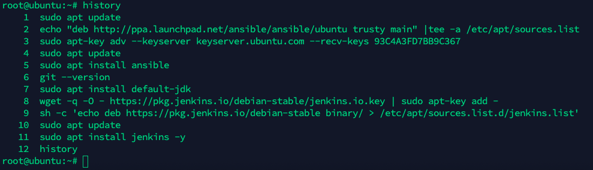

#### Create SSH Keys

Change user to jenkins

```commandline
sudo apt install sshpass
echo password > password.txt

su jenkins
ssh-keygen -t rsa -b 4096 -C "your_email@example.com"
# ssh-copy-id root@134.209.230.48
sshpass -f password.txt ssh-copy-id -o StrictHostKeyChecking=no root@134.209.230.48
exit
```

#### Project folder

Create folder structure and content in all files, make `run.sh` executable.

```commandline
chmod +x run.sh
git commit -m "message"
```

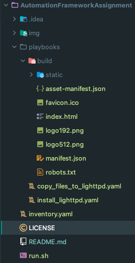

#### Clone Repo on Ansible Server

```commandline
git clone https://github.com/deskavaenkelt/AutomationFrameworkAssignment.git
cd AutomationFrameworkAssignment/
./run.sh
```

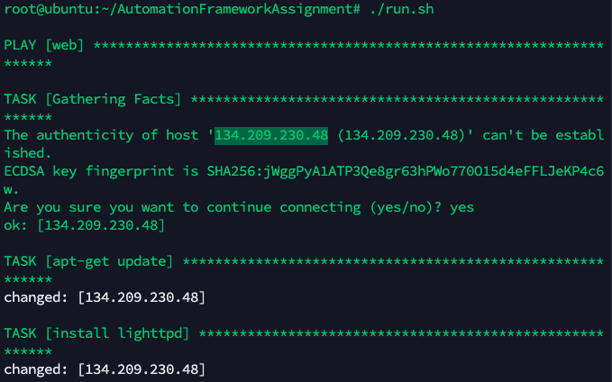

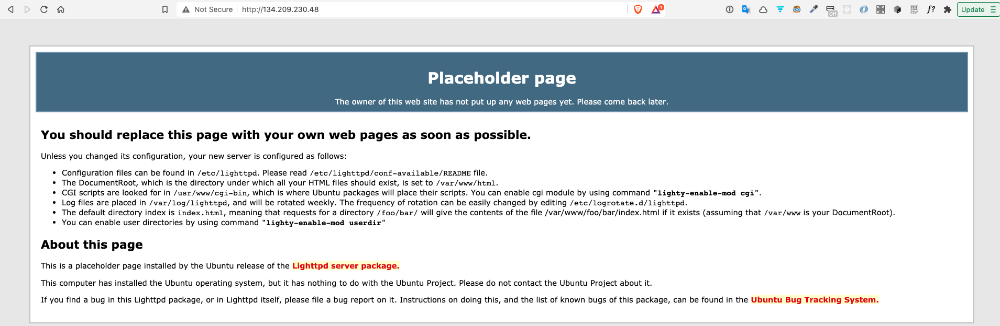

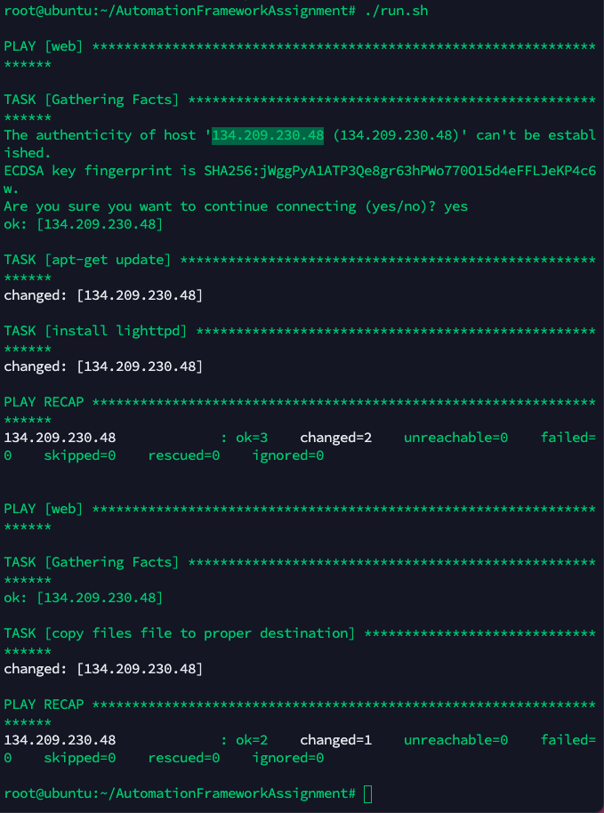

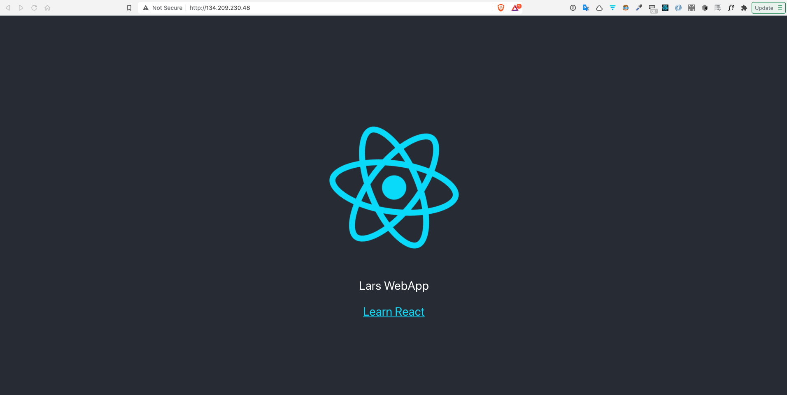

## Github, Jenkins mot en webbserver

### Github

Add ssh key to GitHub Account

```commandline
cat /var/lib/jenkins/.ssh/id_rsa.pub
```

### Jenkins

Connect to the [Jenkins Server](http://104.248.46.151:8080/login?from=%2F)

**Password is located here:**

```commandline
cat /var/lib/jenkins/secrets/initialAdminPassword
```

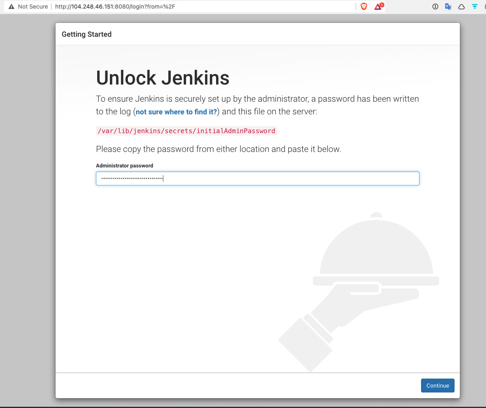

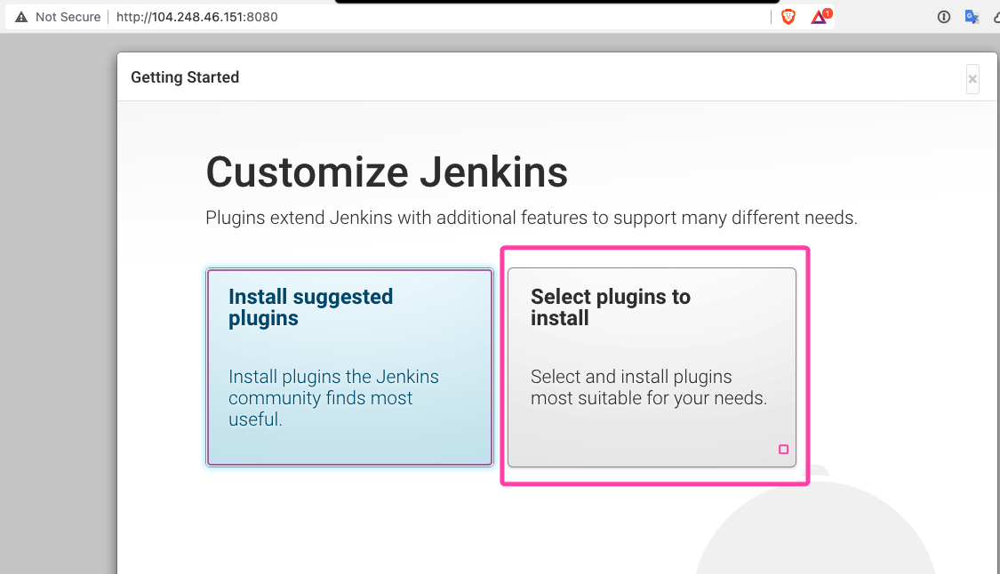

Added:

- Git parameters
- GitHub
- Locale

Installation

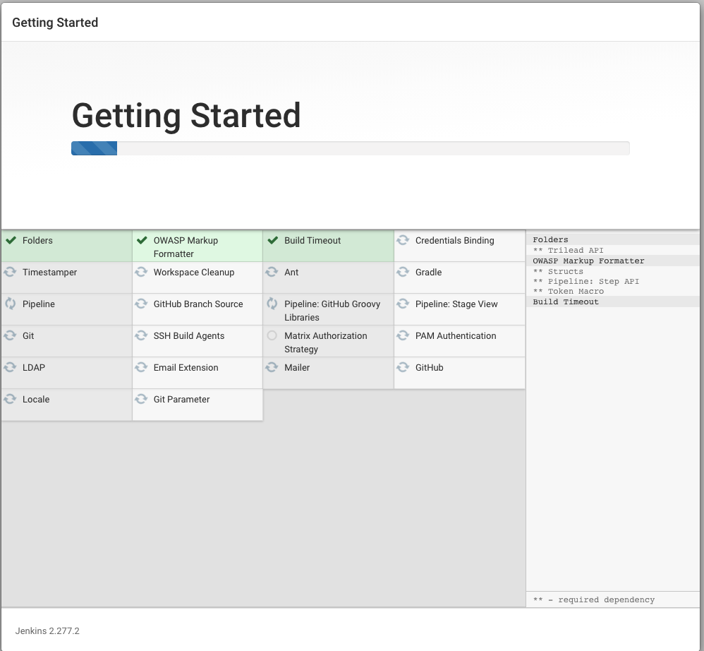

Create First User

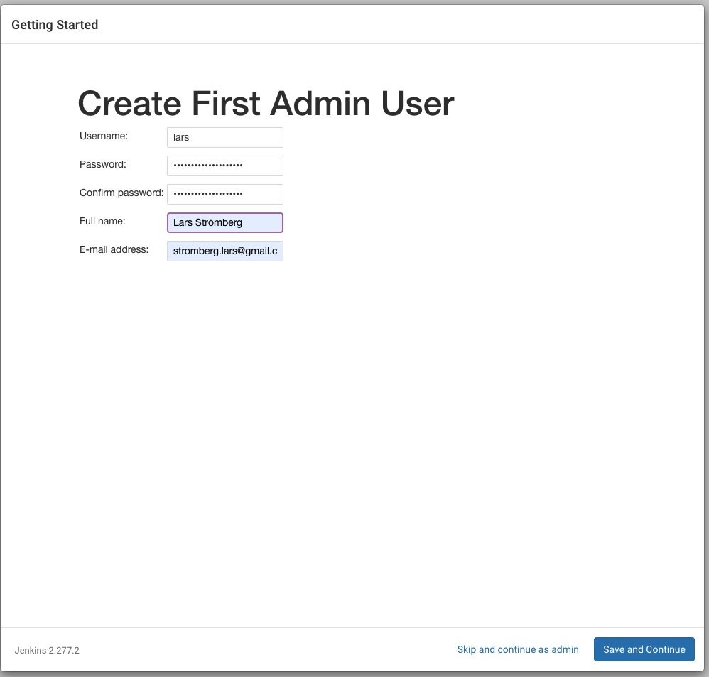

Instance configuration

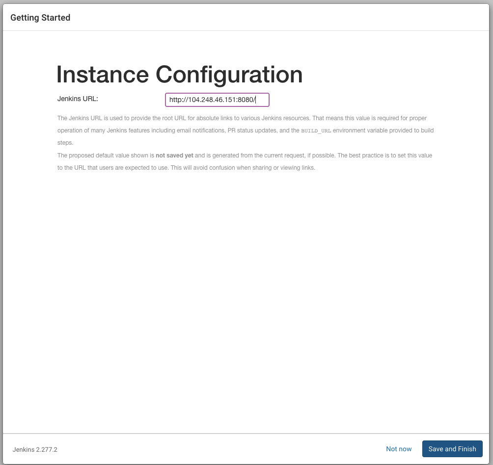

Start site

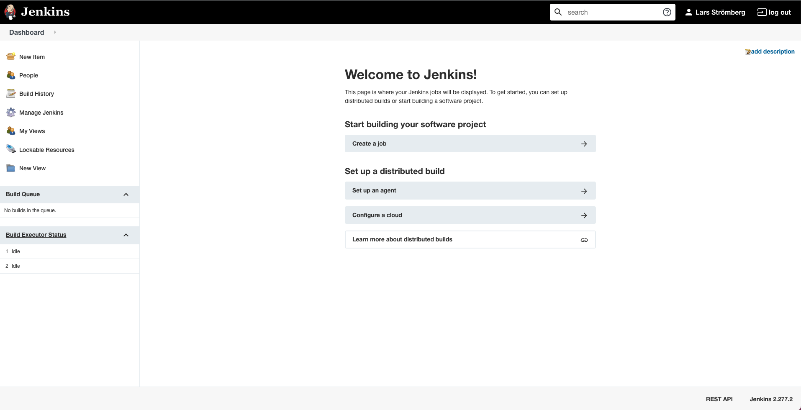

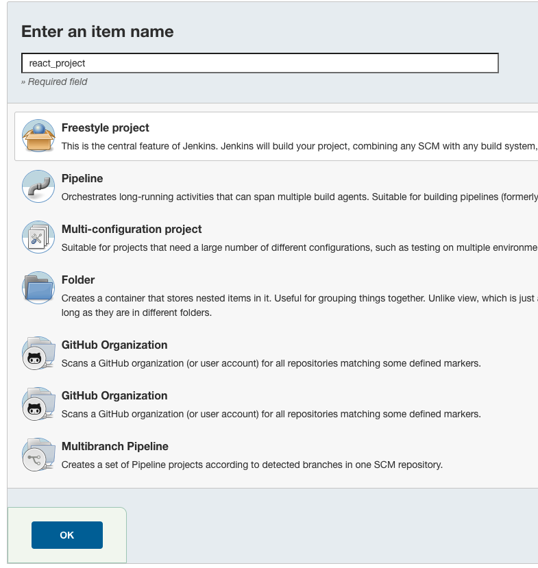

Add GitHub repos

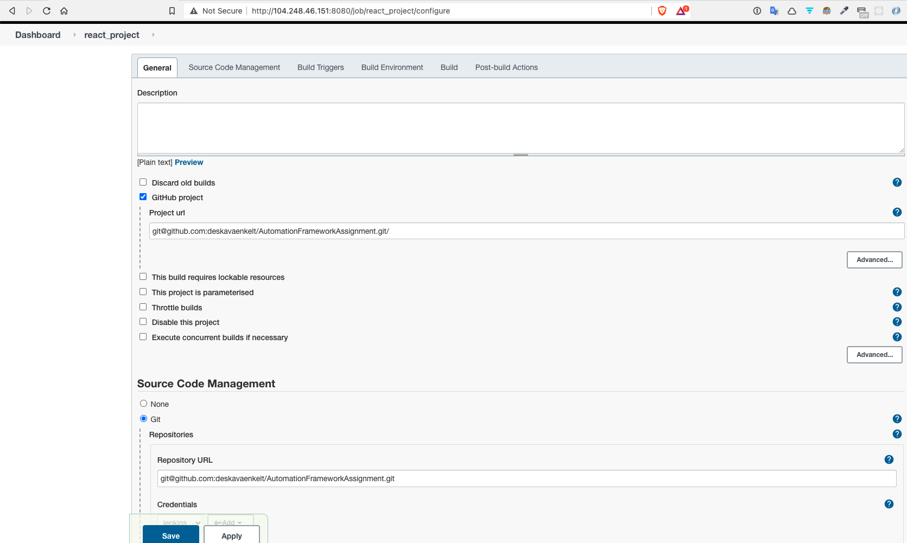

Add SSH key

```commandline
cat /var/lib/jenkins/.ssh/id_rsa
```

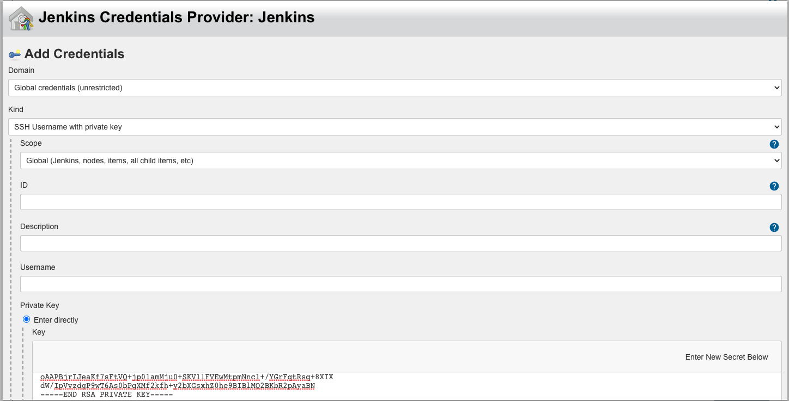

Change to main

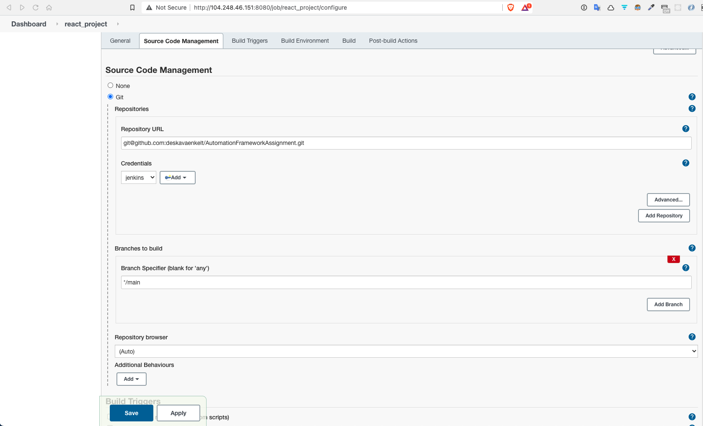

GitHub Web-Hook

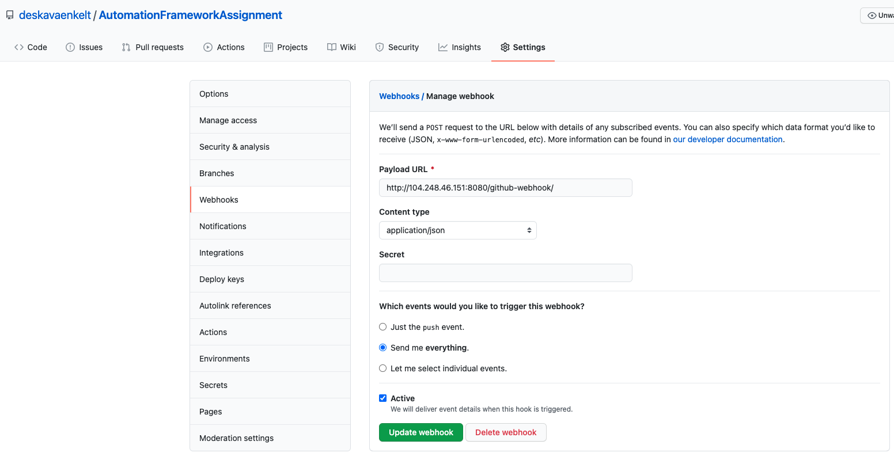

Add build script

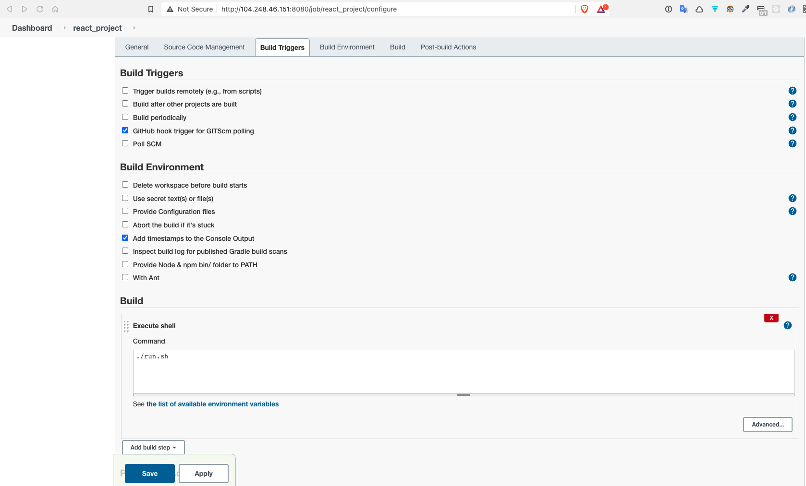

```commandline

```


